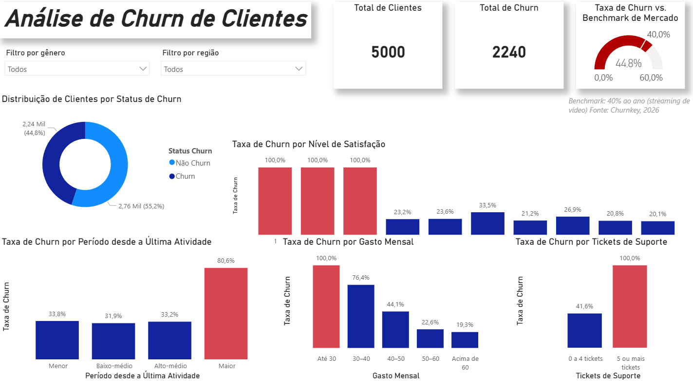
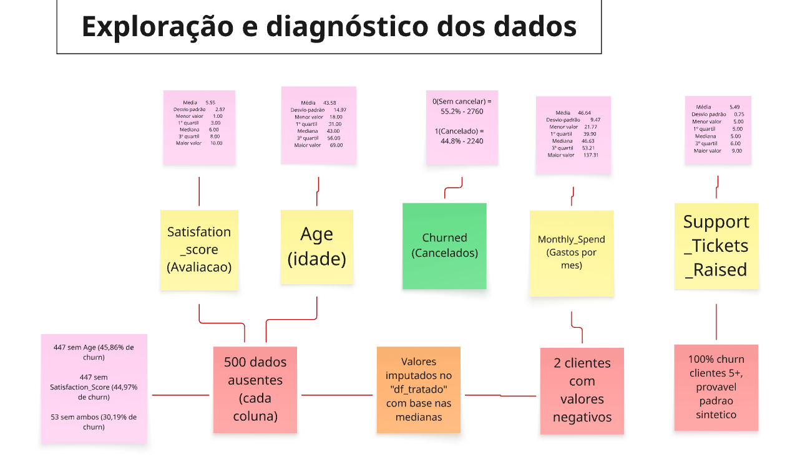
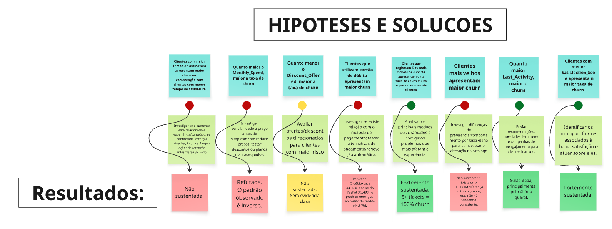

# Análise de Churn — Plataforma de Streaming

## Objetivo

Entender os fatores associados ao cancelamento (churn) de clientes de uma plataforma de streaming, a partir de uma análise exploratória de dados (EDA).

> **Observação:** Como a base apresenta características que podem indicar dados sintéticos (como separações perfeitas de 100% de churn em múltiplos subgrupos), os resultados devem ser interpretados como evidências exploratórias de padrões no dataset, e não como relações de causa e efeito diretamente aplicáveis a uma operação real

## Estrutura do repositório

```
analise-churn/
├── dashboard/
│   └── dashboard-analise.pbix  
├── data/
│   └── Streaming.csv          
├── notebooks/
│   └── exploracao_inicial.ipynb   
├── requirements.txt
└── README.md
```
## Dashboard Executivo
Construção do dashboard interativo para consolidação dos KPIs operacionais e apoio à tomada de decisão:



### Estrutura do Dashboard:
1. **KPIs Principais:** Total de clientes (5.000), total de churn (2.240) e comparativo de taxa de churn vs. benchmark de mercado (44,8% vs 40,0%).
2. **Segmentações:** Filtros dinâmicos por Gênero (*Male, Female*) e Região (*East, North, South, West*).
3. **Visões de Risco:** Gráficos segmentados com alertas em vermelho destacando os grupos críticos de churn (nota de satisfação entre 1 a 3 com 100,0%, inatividade no quartil 'Maior' com 80,6%, gasto mensal até $30 com 100,0% e 5 ou mais tickets de suporte com 100,0%).

## Mapeamento & Teste de Hipóteses (Miro)

Antes de iniciar a codificação e modelagem, utilizei o Miro como um **painel de organização visual** para planejar as etapas da análise, mapear anomalias dos dados e desenhar hipóteses e possíveis soluções para o negócio.

Dividi esse planejamento em duas etapas:

### 1. Exploração e Diagnóstico dos Dados
Mapeamento rápido da distribuição das variáveis, identificação de campos nulos e detecção de anomalias que exigiriam tratamento estatístico prévio no Python:



---

### 2. Rascunho de Hipóteses, Soluções e Resultados
Estruturação de 8 hipóteses de negócio para direcionar a investigação estatística, mapeando as perguntas-chave, as ações propostas e o status final de cada teste:



## Sobre os dados

Dataset com 5.000 clientes e 12 colunas, incluindo idade, gênero, região, método de pagamento, tempo de assinatura, tickets de suporte, satisfação, desconto oferecido, dias desde a última atividade, gasto mensal e status de churn.

## Etapas da análise

1. Overview do dataset (tamanho, tipos, nulos, duplicados)
2. Tratamento de dados ausentes e valores negativos (imputação por mediana)
3. Verificação de qualidade dos dados pós-tratamento
4. Análise de correlação entre variáveis numéricas
5. Teste de 8 hipóteses sobre fatores de churn
6. Criação de dashboard no Power BI para visualização dos dados

## Principais Insights

### 1. Satisfação dos clientes

Clientes com menor nível de satisfação apresentam taxas de churn significativamente maiores.

A análise mostrou que clientes com `Satisfaction_Score` entre 1 e 3 apresentaram 100% de churn, enquanto clientes com níveis de satisfação maiores apresentaram taxas de churn consideravelmente menores.

**Insight:** A satisfação do cliente é um dos principais fatores associados ao cancelamento.

---

### 2. Inatividade dos clientes

Clientes pertencentes ao grupo com maior tempo desde a última atividade apresentaram uma taxa de churn muito superior aos demais grupos.

**Insight:** Clientes com maior período de inatividade apresentam maior risco de cancelamento, especialmente aqueles pertencentes ao último quartil de `Last_Activity`.

---

### 3. Tickets de suporte

Clientes que registraram 5 ou mais tickets de suporte apresentaram 100% de churn na base analisada (278 clientes, 5,56% da base).

**Insight:** Registrar 5 ou mais tickets de suporte é um sinal de risco de churn. 

---

### 4. Gasto mensal

A hipótese inicial de que clientes com maior gasto mensal apresentariam maior churn foi refutada.

Foi observado o padrão contrário: clientes com menor `Monthly_Spend` apresentaram taxas de churn mais elevadas. A taxa de churn caiu progressivamente conforme o gasto mensal aumentou.

**Insight:** Clientes com menor gasto mensal apresentam maior risco de churn na base analisada.

Esse resultado representa uma associação observada nos dados e não permite afirmar que o menor gasto seja a causa do cancelamento.

---

### 5. Principais fatores identificados

A investigação apontou três fatores com evidências mais fortes de associação com o churn:

- **Baixa satisfação**
- **Maior período de inatividade**
- **5 ou mais tickets de suporte**

Além disso, foi identificada uma forte associação entre **menor gasto mensal e maior churn**.

## Como executar

```bash
pip install -r requirements.txt
jupyter notebook notebooks/exploracao_inicial.ipynb
```
